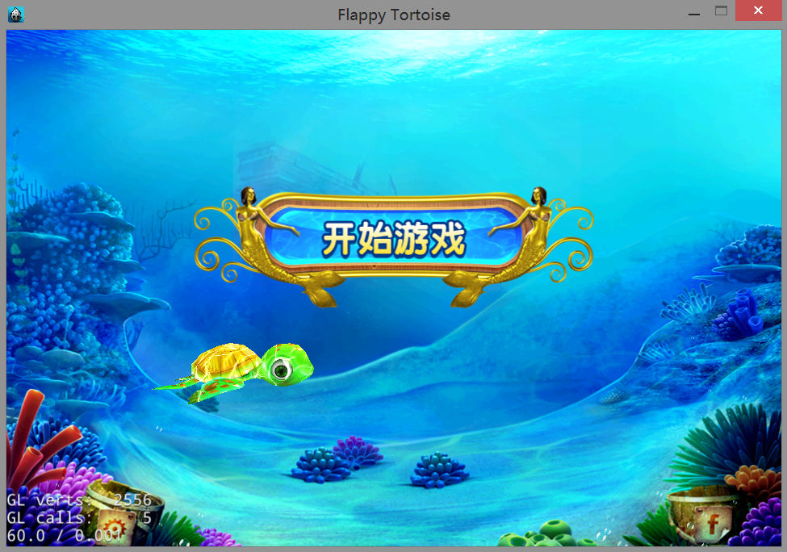
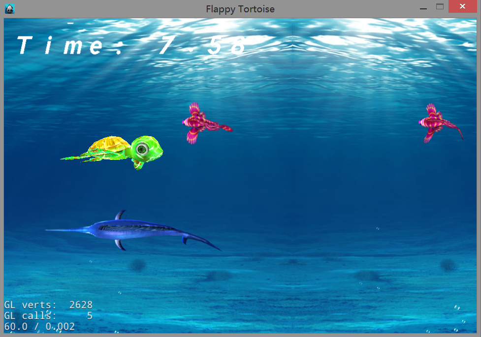
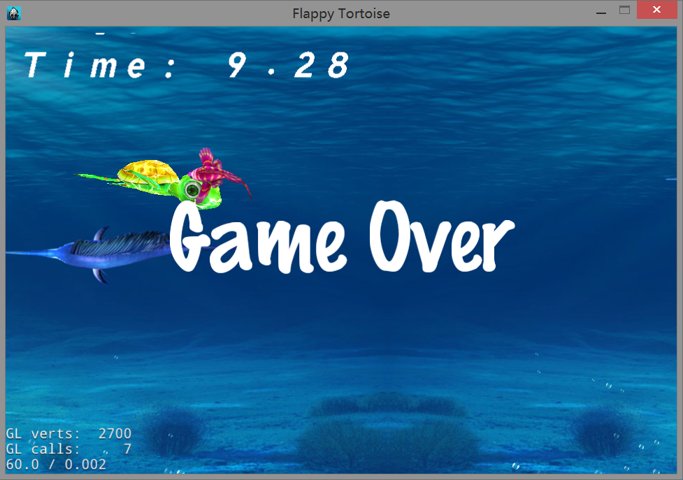

FlappyTortoise
=========
<ul>
  <li><b>语言：</b>C++</li>
  <li><b>开发平台：</b>VS2012  windows</li>
  <li><b>引擎：</b>cocos2dx3.3 rc0</li>

Flappy Bird的操作手法：这次不是来自天空中的小笨鸟，而是来自海洋的小乌龟。

主角小乌龟使用了3D的素材（cocos2d-x的Sprite3D实现），背景仍然是二维平面。

游戏截图
=================
素材均来自原版，版权归原作者所有，此仅供学习之用:) 
 
 
 

游戏下载
=================
下载地址：<a href="FlappyTortoise-debug.apk">点击下载</a> 

注意
=================
代码忽略了cocos2dx的库，你可以在<a href="http://cn.cocos2d-x.org">cocos2dx官方</a>下载。

版权声明
=================
该游戏创意和素材的所有权归原作者所有，本程序仅供学习使用

